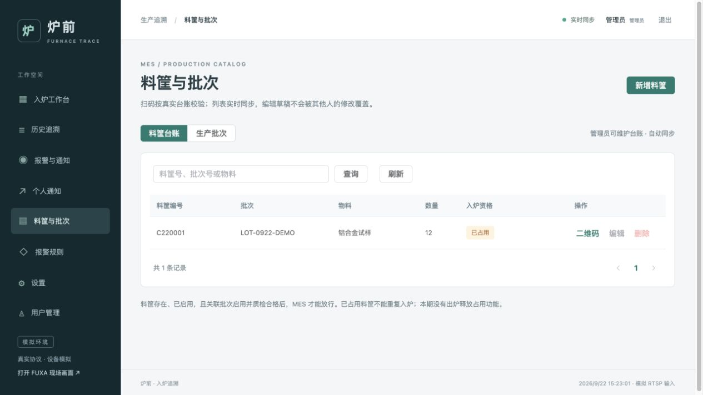
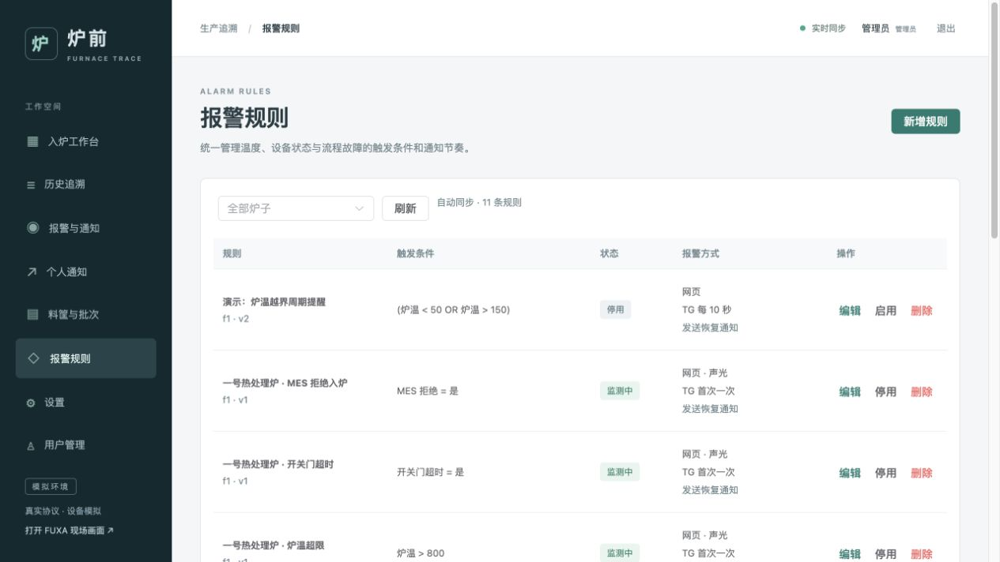

# MES 台账与统一报警规则

更新：2026-09-22。当前新增“料筐与批次”和“报警规则”两个入口，管理员维护、普通用户只读。



## 料筐与批次

1. 在“料筐与批次”切到“生产批次”，创建批次编号、物料名称、工艺说明、质检状态和备注。
2. 质检默认“待检”。只有“合格”且启用的批次才能通过 MES 校验。
3. 切到“料筐台账”，登记料筐编号、关联批次、装载数量和启用状态。
4. 点击“二维码”查看或下载普通 QR Code PNG；码内容就是完整料筐编号。默认编号为 7 位字母数字，编号创建后不可更改。
5. 编辑和删除需要管理员权限。正在入炉或已占用的料筐不可修改、删除；批次关联活动周期时不可修改，仍关联未删除料筐时不可删除。

删除采用逻辑删除，编号和历史追溯保留，删除后的编号不能重新使用。批次质检状态或物料后续改变，不覆盖旧入炉记录中的 MES 快照。

列表通过现有 SSE 接收台账版本变化，其他页面会自动重新查询。正在编辑的草稿不会被推送覆盖；提交时携带记录版本，版本落后会提示重新打开编辑，防止覆盖其他人的更新。

## 放行依据

独立 `mes` 服务查询 PostgreSQL 台账，替代旧的 `mes-sim` 前缀判断。服务使用只读数据库会话；台账维护由 core 的管理员 API 完成。

- 料筐不存在或已删除：返回 `0 / NOT_FOUND`，拒绝。
- 料筐停用、批次停用/删除、待检或质检不合格：返回 `2` 和具体原因，拒绝。
- 料筐存在、启用，关联批次启用且质检合格：返回 `1 / ALLOWED` 和校验快照。
- 数据库或 MES 通信不可用：有限重试后进入待处理，不默认放行。

core 收到允许结果后，在保留料筐占用的事务中再次核对台账版本和状态，避免校验与编辑之间的时间差。已有占用仍会拒绝。历史详情保存校验当时的料筐、批次、物料、工艺、数量和质检快照。

`BAD`、`UNK` 等前缀不再有特殊含义。一个编号能否入炉，取决于真实台账；未知编号不会自动登记。

`python3 scripts/demo.py success` / `reject` 会显式准备演示批次与料筐，再驱动独立模拟设备。已有台账不被脚本偷偷改成合格或不合格；也可以传入在网页登记好的料筐编号演示。



## 所有报警统一为规则

旧的独立炉温设置接口与硬编码报警创建/恢复入口已移除。首次迁移会将原炉温上限、恢复温差和活动报警接入统一规则；旧温度配置表仅归档为 `core.temperature_alarm_settings_legacy`，运行期不再使用。

系统为每台炉子创建普通的预置规则：炉温超限、摄像头离线、设备通信异常、扫码失败、MES 拒绝、MES 通信失败、开关门超时、入炉到位超时、复位超时、入炉执行异常。预置规则和新规则一样可编辑、停用、删除；删除后重启不会重新生成。

**报警配置不改变业务安全约束。**例如关闭 MES 拒绝报警，仍不能让不合格料筐开门。正常复位不算故障；异常周期人工复位时，原故障信号保留到复位反馈确认。

## AND / OR 与上下限

在“报警规则”点击“新增规则”，选择炉子和条件：

- 数值：炉温，支持 `>`、`>=`、`<`、`<=`、`=`、`!=`。
- 布尔状态：入口/炉内到位、炉门开关、各设备/摄像头在线、扫码/MES/流程故障，支持等于或不等于。
- 组合：AND 表示全部条件满足；OR 表示任意条件满足。支持最多 4 层嵌套、每个条件树最多 16 个叶子条件。

示例：

```text
触发：(炉温 < 650 OR 炉温 > 850) AND 炉门已关闭
恢复：炉温 >= 655 AND 炉温 <= 845
```

未设置恢复条件时，触发条件明确不成立即结束报警。缺少新数据的条件为“未知”，不会当成正常数值。触发和恢复同时成立时优先保持报警，避免来回触发。给温度恢复条件留出回差，可以减少临界点反复通知。

## 报警方式与定时提醒

每条规则可设置：

- 网页报警记录：始终保留。
- 现场声光：通过 FUXA/MQTT 驱动独立报警器模拟器，可关闭。
- Telegram：可关闭；支持每次故障首次发送一次，或每隔 10–86400 秒提醒。
- 恢复通知：可选，结束报警时另外发送一次。
- 通知分组：对应每个用户“个人通知”的类别。用户仍需绑定 Bot、启用通知并订阅相应炉子和类别。

一次故障对应一个报警编号；持续状态不创建重复活动报警。`repeatSeconds=0` 表示不主动重复提醒，恢复后再次发生故障会创建新的报警编号。

规则与下一次提醒时间都保存在 PostgreSQL。重启后保留活动报警，不重发首次通知，也不补发所有错过的提醒。发送积压时只保留较新的待发重复提醒；结束报警会取消待发提醒，并阻止迟到提醒重新排队。已经开始发送的消息可能仍到达。

“确认已查看”不等于故障恢复，不停止定时提醒。停用或删除规则会结束该规则的活动报警，消息明确说明是规则结束，不宣称现场故障已经消除。

## 持久表与运行边界

- `core.batches`、`core.baskets`：生产台账。
- `core.catalog_revision`：台账及规则版本，用于 SSE 同步。
- `core.alarm_rules`、`core.alarm_rule_states`：规则配置、活动报警关联及提醒时间。
- 原 `core.cycles/events/alarms/outbox/audit`：周期、快照、事件、报警、通知任务和审计。
- `notify.closed_rule_alarms`：结束报警的提醒取消标记，避免迟到任务继续发送。

这是一套数据驱动的简化 MES，不包含完整工厂排产、采购、出炉或质量系统集成。真实 IP 摄像头与真实设备仍待后续接入。

本次演示批次为 LOT-0922-DEMO、料筐为 C220001；该料筐已经成功入炉并保留占用。自定义低阈值演示规则已停用，可在规则页查看其 OR 触发、AND 恢复与 10 秒提醒配置。
