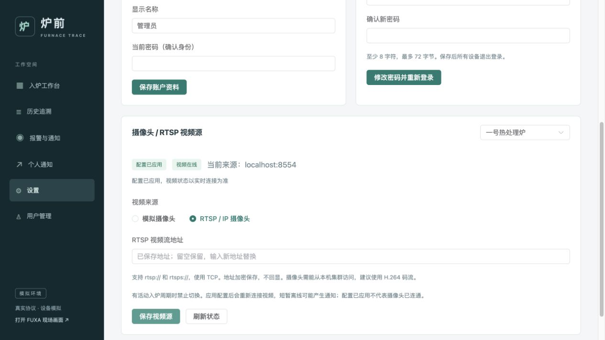
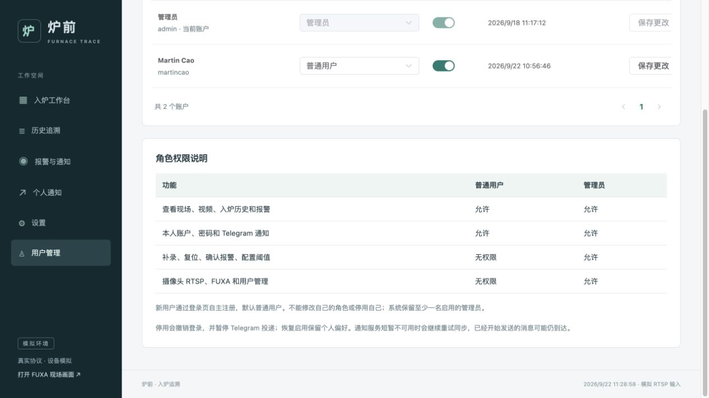

# 设置、用户管理与现场动画

更新日期：2026-09-22。打开工作台并刷新页面后，左侧新增“设置”；管理员同时看到“用户管理”。

## 个人账户

进入 **设置 → 账户资料**，修改登录用户名、显示名称，并输入当前密码确认。用户名为 3–32 位字母、数字或下划线，不区分大小写。保存后用新用户名登录；内部用户 ID 不变，原 Telegram 绑定、个人通知偏好与历史关联保留。

进入 **设置 → 修改密码**，填写当前密码、新密码和确认新密码。新密码至少 8 字符，UTF-8 不超过 72 字节。保存后本人所有会话失效，需要重新登录。`.env` 只用于首次创建管理员，已有账户的用户名和密码应在设置页修改。

## 管理员配置 RTSP

进入 **设置 → 摄像头 / RTSP 视频源**：

1. 选择炉子；默认是一号热处理炉。
2. 选择“模拟摄像头”，或“RTSP / IP 摄像头”。
3. 使用 IP 摄像头时，输入完整地址，例如 `rtsp://用户名:密码@192.168.1.50:554/stream1`，点击“保存视频源”。
4. 等待“配置已应用”，再确认“视频在线”。前者只代表媒体服务接受了配置，后者才代表识别服务收到了新鲜视频帧。
5. 返回入炉工作台查看预览。接入失败可切回“模拟摄像头”。

只接受 `rtsp://` / `rtsps://`，传输使用 TCP。建议 H.264 码流，二维码需清晰。摄像头地址必须能从 Kubernetes 集群访问。

有活动入炉周期时拒绝切换；先完成或按约束复位周期。切换过程中阻止开启新周期，并留出解码器重连时间。短暂视频离线可能触发已有订阅通知。

完整 RTSP 地址使用 AES-GCM 加密后存入 PostgreSQL。管理员设置页回显完整地址，使用可见的文本输入框；普通用户无权访问。编辑期间的后台状态刷新不会覆盖草稿。保存 RTSP 模式时必须填写完整地址。切到模拟源也会保留之前保存的外部地址，方便以后切回。

`CAMERA_ENCRYPTION_KEY` 由初始化脚本生成，通过 Secret 注入。备份数据库时应同时保留该密钥；不要随意更换。MediaMTX 配置 API 使用服务认证，视频发布和读取也使用内部凭据；仅本机 loopback 可无凭据读取模拟路径。

配置通过 [MediaMTX v1.15.6 的配置 API](https://github.com/bluenviron/mediamtx/blob/v1.15.6/api/openapi.yaml) 应用；后台定期核对数据库期望配置，媒体服务重启后自动恢复。摄像头模拟器独立发布到 `{furnaceId}-sim`，业务预览和识别始终读取 `{furnaceId}`。

## 用户角色与管理

批次、料筐和全部报警规则已迁到独立页面，详见 [MES 台账与报警规则](catalog-and-rules.md)。

管理员进入 **用户管理**，选择目标账户的角色、启用状态，再点“保存更改”。新用户通过登录页自主注册，默认普通用户。

| 能力 | 普通用户 | 管理员 |
|---|---|---|
| 查看所有炉子的状态、预览、历史、报警 | 允许 | 允许 |
| 修改本人资料和密码，设置本人 Telegram 通知 | 允许 | 允许 |
| 补录、复位、确认报警、维护台账与报警规则 | 拒绝 | 允许 |
| 配置 RTSP、访问 FUXA、管理其他用户 | 拒绝 | 允许 |

后端在每次请求时检查角色。角色或启用状态改变会撤销目标用户已有会话；不能修改自己的角色或停用自己，必须保留至少一个启用的管理员。

停用账户后不能登录，通知服务收到持久同步任务后暂停投递并取消未发送任务。已开始发送的消息可能仍到达；服务暂不可用时会重试同步。恢复启用保留原通知偏好，不重发已取消的任务。角色降为普通用户不会自动删除 Telegram 绑定，因为普通用户仍可订阅通知。

本版采用管理员与普通用户两种固定角色，没有自定义角色编辑器或按炉子限制生产数据查看范围。

## 首页现场动画

- 炉门：按门开/门关反馈平滑升降；收到开门命令但尚未反馈时，不提前画成已打开。
- 料筐：入口到位时出现，炉内到位反馈后向炉内移动。
- 输送滚轮：在入炉到位后的关门/复位阶段显示运动。
- 扫码光线：仅在实际扫码会话期间扫描。
- 声光报警：按报警器反馈闪烁。
- 炉温：在线读数高于 100°C 时显示热流效果，100°C 仅是动画效果阈值，不是业务报警上限。
- 设备离线：动画暂停、显示最后状态；系统的减少动态效果偏好也会关闭动画。

动画解释后端反馈，不参与状态机判断，不把未知执行结果画成成功。真实 IP 摄像头仍需后续真机验证。

用户管理的事务锁与通知服务的实例锁使用不同命名空间；有其他权限修改正在执行时立即提示忙碌。后端处理有 5 秒上限，网页请求有 15 秒超时，失败时结束加载并提示核实当前状态。
