# 炉前 · 入炉追溯系统操作手册

> 最新 MES 台账与全部报警规则功能见 [增量说明](catalog-and-rules.md)。旧炉温配置入口已退役。

> 2026-09-22 增量：新增设置、用户管理和反馈动画，详见 [设置说明](settings.md)。本手册与 PDF 截图保留 2026-09-21 版本界面；当前连续扫码与自动恢复行为以 [配置与运行](operations.md) 为准。

版本：2026-09-21 · 本地模拟演示版  
适用对象：答辩演示人员、管理员和普通用户。

本文使用本机实际运行截图，说明系统有什么功能、每个页面如何使用，以及一条料筐入炉记录如何产生。截图中的设备、摄像头画面和 MES 数据由模拟程序提供，RTSP、MQTT、FUXA、数据库和业务处理链路实际运行。

## 1. 系统能做什么

系统围绕“料筐是否允许入炉、设备是否真正执行、事后能否追溯”工作。

| 功能 | 用户可以看到或完成的操作 |
|---|---|
| 账户与权限 | 自主注册、登录、退出；管理员可以补录、复位、确认报警、配置阈值及访问 FUXA |
| 实时工作台 | 查看炉门、入口到位、声光报警、炉温、摄像头预览与当前入炉阶段 |
| RTSP 扫码 | 料筐到位后开启扫码窗口，识别摄像头中的二维码，保留原文并提取料筐号 |
| MES 校验 | 判断料筐存在与否、质量是否正常；拒绝时不发开门命令 |
| 入炉闭环 | 开门、等待入炉到位、关门、复位；收到匹配设备反馈后归档 |
| 人工异常处理 | 扫码失败可补录；未决周期可在现场满足条件后复位；记录操作原因 |
| 炉温模拟与报警 | 在 FUXA 输入模拟温度；工作台显示回传读数，并配置超温上限和恢复温差 |
| 历史追溯 | 按完整料筐号查询记录，查看时间线、周期编号和设备命令反馈 |
| Telegram 通知 | 每个用户自行配对同一个 Bot，按炉子、类别、恢复通知和总开关订阅 |

**当前范围：**只做入炉，不含出炉、水压、真实 PLC、真实 MES 或 Telegram 远程开门。默认一台炉子 `f1`；真实 IP 摄像头留待后续接入。炉温用于监测和报警，当前不参与入炉放行联锁。

### 通信关系

```text
模拟/真实摄像头 → MediaMTX（RTSP）→ vision 扫码 → core → MES 校验
Vue 工作台 ← HTTP / SSE → core → PostgreSQL 归档
core → scada-adapter → FUXA → MQTT → 炉门/报警器模拟器
传感器与执行器反馈 → MQTT → FUXA → scada-adapter → core
FUXA 温度输入 → MQTT → 独立温度模拟器 → 同一反馈路径
core 报警任务 → 独立 notifier → 用户自己的 Telegram 私聊
```

FUXA 承担方案中 WinCC 的 SCADA/HMI 角色。本实现没有运行西门子 WinCC。业务服务不会直接通过 MQTT 控制设备。

## 2. 入口、登录与权限

服务启动后，在本机打开：

- 业务工作台：[http://localhost:31080](http://localhost:31080)
- FUXA 现场页面：[http://localhost:31081](http://localhost:31081)
- Telegram Bot：使用部署时在 `.env` 中配置的 Bot。

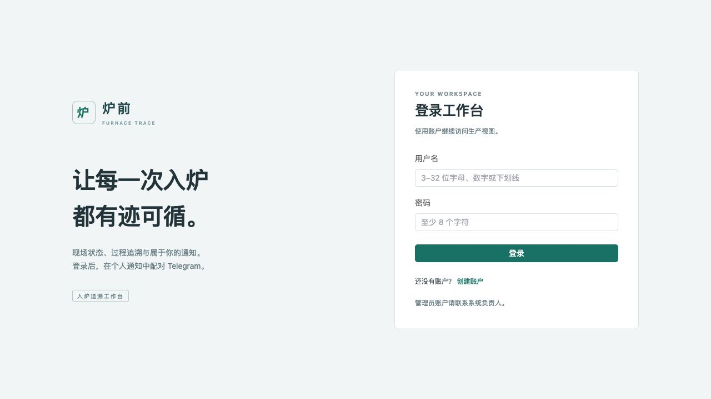

1. 普通用户点击“创建账户”，填写页面要求的信息，注册后登录。
2. 管理员使用根目录 `.env` 中首次初始化的 `ADMIN_USERNAME` / `ADMIN_PASSWORD`。手册不展示密码。
3. 进入工作台后，右上角显示当前身份，并提供“退出”。会话默认有效 12 小时，过期后重新登录。
4. 打开 FUXA 前，先在同一浏览器以管理员身份登录工作台。FUXA 入口复用登录状态。

| 操作 | 普通用户 | 管理员 |
|---|---|---|
| 查看现场、视频、历史、报警 | 可以 | 可以 |
| 绑定自己的 Telegram、修改个人偏好 | 可以 | 可以 |
| 人工补录、人工复位、确认报警 | 不可以 | 可以 |
| 配置炉温报警阈值、访问 FUXA 设温 | 不可以 | 可以 |

## 3. 入炉工作台：各区域代表什么

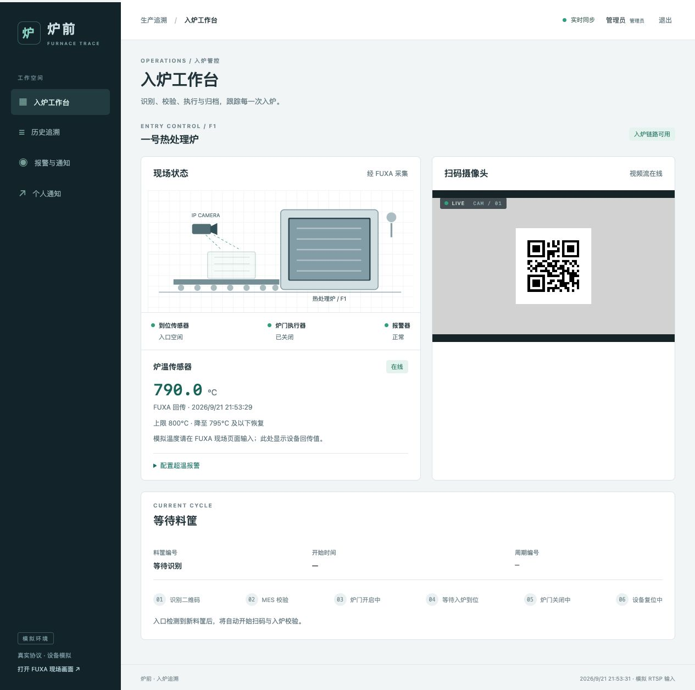

| 页面位置 | 功能与读法 |
|---|---|
| 左侧导航 | 切换入炉工作台、历史追溯、报警与通知、个人通知 |
| 左下角 FUXA 链接 | 管理员打开现场页面，在那里设置模拟炉温 |
| 右上角“实时同步” | 当前网页正在接收后端状态；断线时会提示重新连接 |
| 炉子名称旁“入炉链路可用” | 入炉相关设备与摄像头具备开始流程的条件；不代表一个周期已经成功 |
| 左侧“现场状态”示意图 | 炉门位置、入口料筐、报警器与设备状态；图形来自设备反馈 |
| 设备状态条 | 到位传感器、炉门执行器、报警器在线状态与最近读数 |
| “炉温传感器” | 经 FUXA 回传的温度、时间、是否超温；管理员可展开报警配置 |
| 右侧“扫码摄像头” | 浏览器播放 HLS 预览；后台识别服务读取 RTSP；预览可能有缓冲延迟 |
| 下方“当前周期” | 料筐号、开始时间、周期编号和六个处理阶段；异常时显示原因及可用操作 |

摄像头持续扫码。**稳定识别到二维码即视为料筐到位，自动开始 MES 校验。**空画面不创建周期，同一码持续停留只触发一次；移除二维码约一秒或换码后可重新识别。

实时工作台自动更新；历史和报警列表需要进入页面或点击“刷新”获取最新结果。

## 4. FUXA 现场页面：手动设置炉温

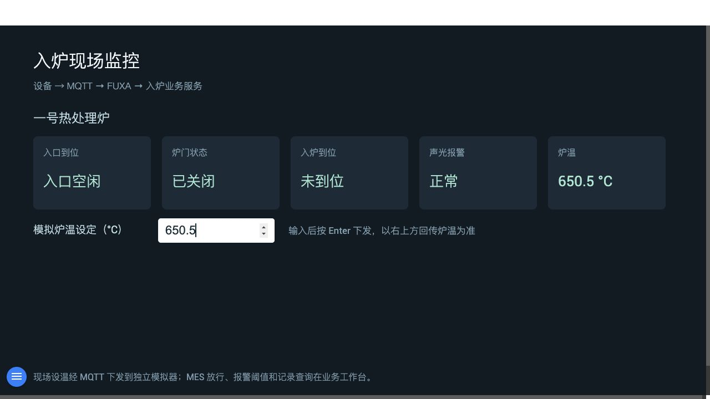

从左到右五块显示：入口到位、炉门状态、入炉到位、声光报警、炉温。

1. 管理员打开 FUXA 现场页面，确认已出现设备读数。
2. 在“模拟炉温设定（°C）”输入框输入数值，例如 `650.5`。
3. **按 Enter 下发。**只输入而不按 Enter，不会执行设温。
4. 观察右上角“炉温”变成 `650.5 °C`。再返回业务工作台，确认回传读数一致。

输入框表示希望模拟的温度，右上角显示温度模拟器实际执行后回传的读数。两者没有同步时，不要仅凭输入框判断设定成功。

命令经 FUXA → MQTT 到独立温度模拟器；反馈经 MQTT → FUXA → 适配服务返回。每次命令有独立编号、目标启动编号和 10 秒有效期；命令不做 MQTT retain 保留。模拟器重启后温度回到 25°C。

FUXA 显示最近接收的点位值；是否在线以工作台的新鲜度判定为准。如果打开了 FUXA 自带的 Alarms 面板，它不等于业务报警记录；本系统的超温和入炉报警请在工作台“报警与通知”查看。

## 5. 炉温报警配置与恢复

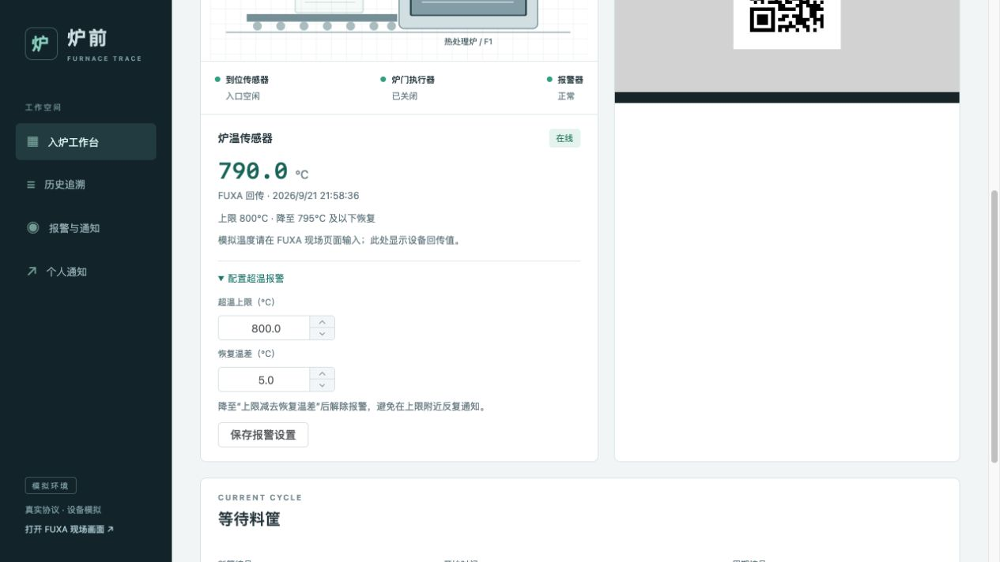

管理员在工作台展开“配置超温报警”，修改“超温上限”和“恢复温差”，点击“保存报警设置”。设置保存在 PostgreSQL，服务重启后保留。

默认演示参数：上限 **800°C**，恢复温差 **5°C**。

| 回传温度 | 预期结果 |
|---|---|
| 650.5°C | 正常 |
| 810°C | 大于 800°C，产生 `TEMPERATURE_HIGH` 报警 |
| 798°C（已有超温报警） | 尚未降至 795°C，报警保持 |
| 790°C（已有超温报警） | 已低于恢复线，报警恢复 |

无新数据或传感器离线时，不把温度当成已恢复。入炉完成、人工复位和“确认已查看”也不会替代炉温恢复判断。这里的 800°C 是演示默认值，不是工艺标准。

## 6. 报警与通知：如何处理异常

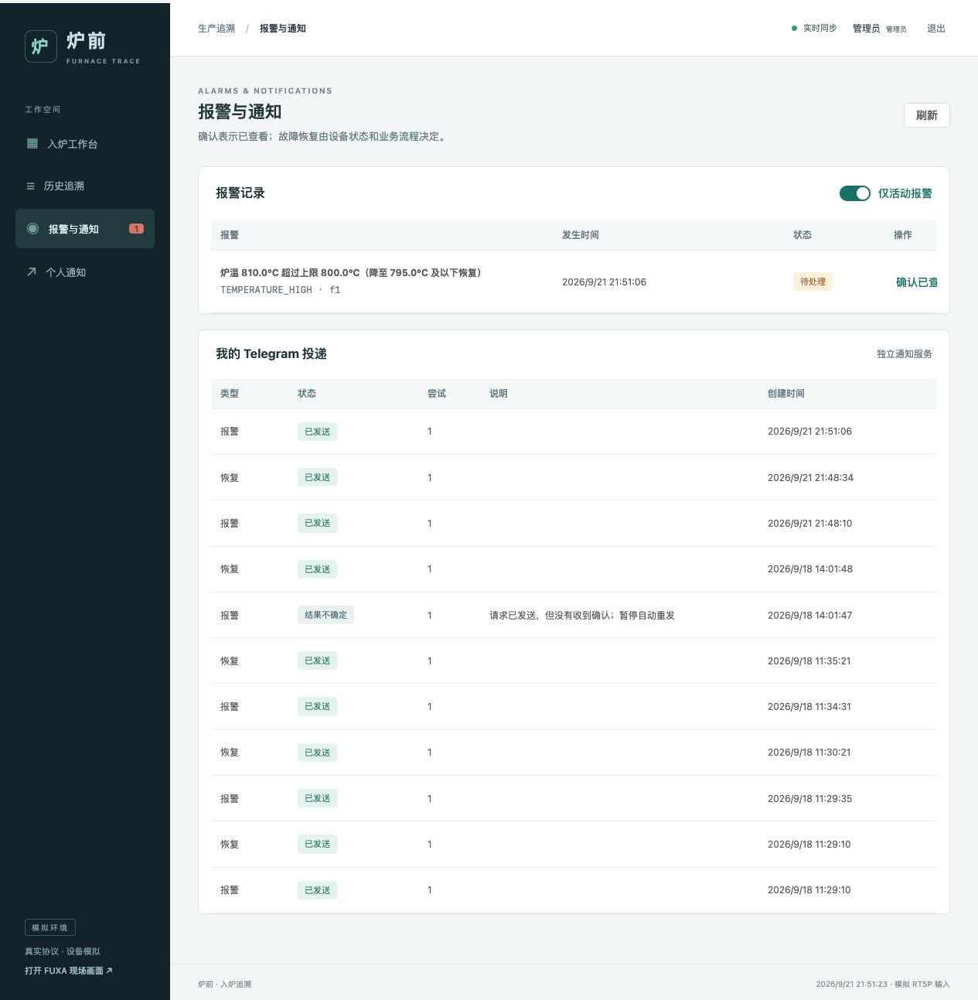

- **上方“报警记录”**：全系统业务报警，包含炉子、原因、发生时间及状态。
- **“仅活动报警”开关**：开启时只看尚未恢复的报警；关闭后可以看历史恢复记录。
- **“确认已查看”**：管理员填写备注，表示有人开始处理。确认后故障仍可能存在。
- **下方“我的 Telegram 投递”**：当前登录用户自己的通知结果，其他用户的投递不会显示在这里。

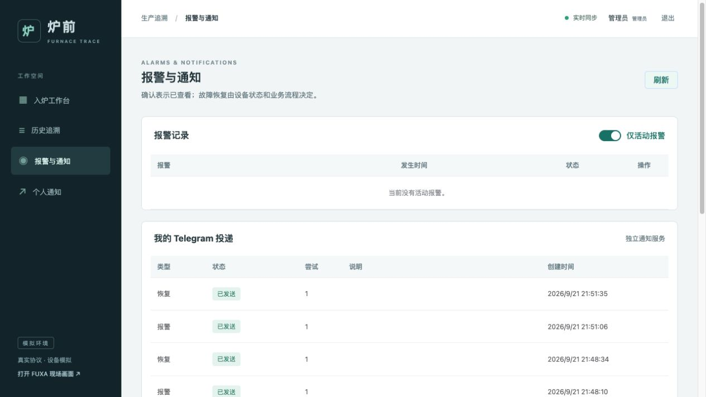

| 投递状态 | 含义 |
|---|---|
| 等待发送 | 任务在队列中，或等待可重试条件 |
| 已发送 | Telegram API 已确认成功；不代表用户已经阅读 |
| 发送失败 | 收到明确失败结果，需要处理对应配置或权限问题 |
| 结果不确定 | 请求可能已经到达 Telegram，但没有可靠确认；暂停自动重发 |
| 已取消 | 解绑、关闭通知或偏好变化使该任务不再需要发送 |

启停部署时可能看到 SCADA/适配服务的离线、恢复成对出现，这是对通信变化的记录。稳定运行时若反复出现，则需要查看相关服务，不应忽略。通知发送异常不阻塞入炉业务。

## 7. Telegram 配对与个人订阅

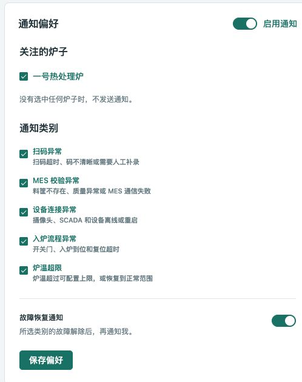

### 首次绑定

1. 注册或登录自己的工作台账户，进入“个人通知”。
2. 打开部署时配置的 Telegram Bot，在**私聊**中发送 `/start`。
3. Bot 回复一次性配对码，10 分钟内有效。
4. 回到网页，在“Telegram 配对”区域填写配对码，点击“完成配对”。
5. 页面显示“已绑定”，Bot 回复配对成功。
6. 选择关注的炉子、通知类别，设置总开关与恢复通知，然后点击“保存偏好”。

没有选择任何炉子时不发送通知；未绑定时可以先保存偏好。每个用户独立设置，不需要也不应该在 `.env` 中写死 Chat ID。一个 Telegram 私聊只能绑定一个网页账户。

五类通知分别是：扫码异常、MES 校验异常、设备连接异常、入炉流程异常、炉温超限。要收到高温报警与恢复，需要选择对应炉子、勾选“炉温超限”，并打开“启用通知”和“故障恢复通知”。

Bot 的 `/status` 查看绑定状态，`/unlink` 解绑；网页“解除绑定”也可解绑。解绑会取消尚未发送的个人通知，已经开始发送的消息可能仍会到达。配对码属于本人绑定凭据，不展示给其他用户。

## 8. 完整入炉操作流程

### 演示前准备

以管理员登录，打开“入炉工作台”，确认“入炉链路可用”、视频流在线、炉门已关、入口空闲，且没有待处理周期。新入炉使用一个未被成功占用的料筐号。

目前没有真实 PLC 或输送线。料筐出现、二维码出现、料筐进入炉内，由独立模拟器提供；场景脚本协调这些外部动作。网页没有“强制成功”或绕过 MES 的开门按钮。

### 运行一次正常场景

在项目根目录执行：

```fish
python3 scripts/demo.py success
```

该命令自动选择新料筐号并协调一次模拟过程。需要指定编号时，可以用 `python3 scripts/demo.py success ABC0001`，但同一成功占用编号不能直接再次入炉。

| 顺序 | 现场输入或系统行为 | 页面变化 |
|---|---|---|
| 1 | 模拟摄像头显示二维码，入口检测到料筐 | 创建周期，进入“识别二维码” |
| 2 | RTSP 抽帧，连续两帧识别到同一码 | 提取料筐号，进入“MES 校验” |
| 3 | MES 返回允许 | 进入“炉门开启中”，发送开门命令 |
| 4 | 炉门模拟器反馈匹配命令且门已开 | 进入“等待入炉到位” |
| 5 | 模拟入口清空、炉内到位信号变为真 | 进入“炉门关闭中” |
| 6 | 收到门已关闭反馈 | 进入“设备复位中” |
| 7 | 收到复位反馈，数据库归档 | 当前周期回到等待料筐；历史增加成功记录 |

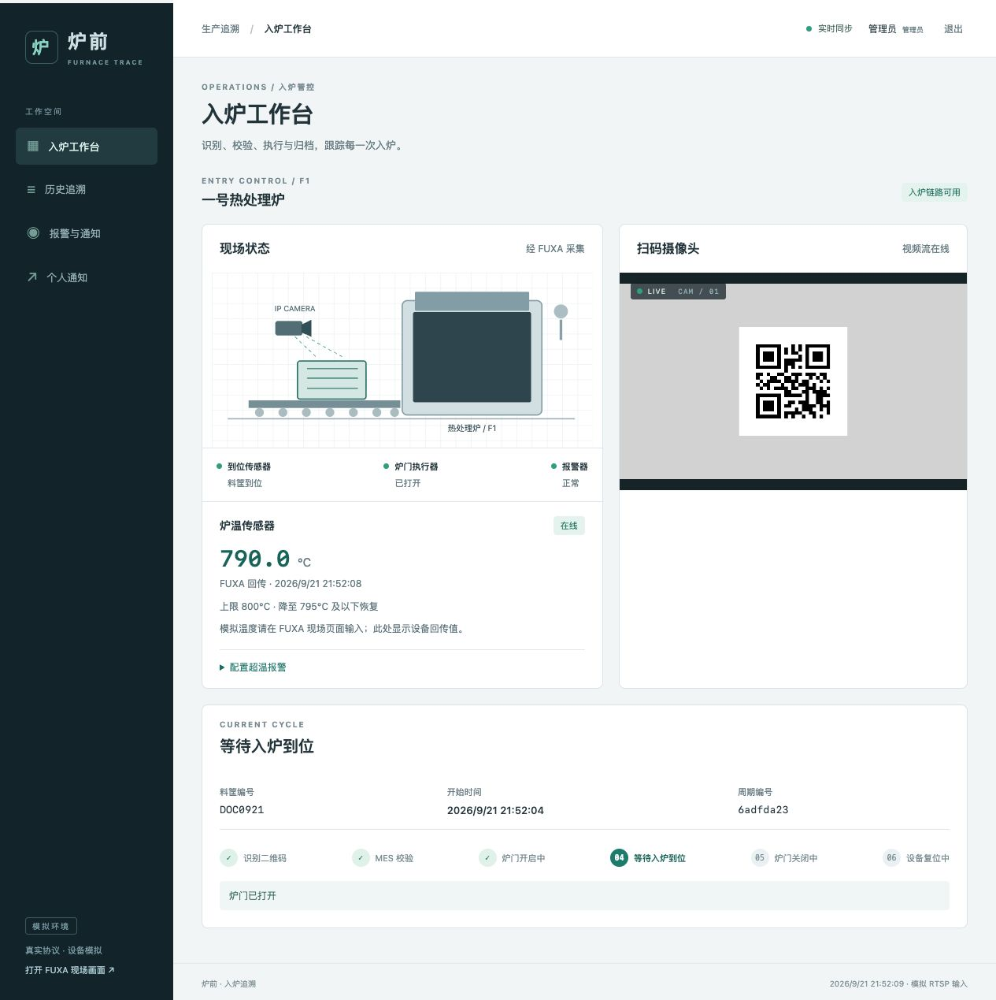

截图为分步演示时捕获；自动场景脚本会继续提交入炉到位信号，不需要操作员在网页点击“下一步”。二维码通常取末尾 7 位字母数字作为料筐号，例如 `TR04DOC0921` 得到 `DOC0921`。

## 9. 历史追溯：查清一次入炉为什么成功

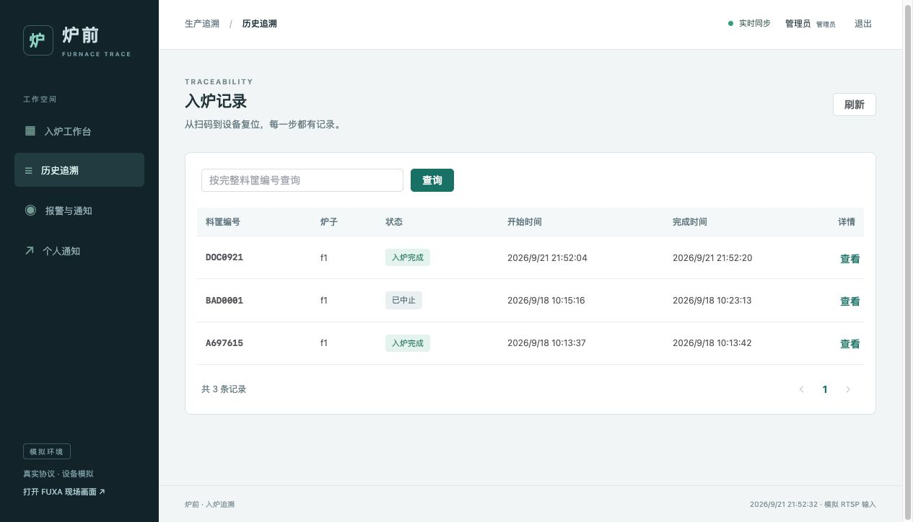

1. 点击“历史追溯”，在搜索框输入**完整料筐编号**，点击“查询”。留空查询全部记录。
2. 查看炉子、状态、开始时间与完成时间。需要更新时点“刷新”。
3. 点击一行或“查看 →”，打开右侧“入炉过程追溯”。
4. 按时间线核对到位、识别、MES、开门、入炉、关门、复位和完成。
5. 向下滚动查看设备命令。本次正常记录中 `OPEN`、`CLOSE`、`RESET` 都是 `COMPLETED`。

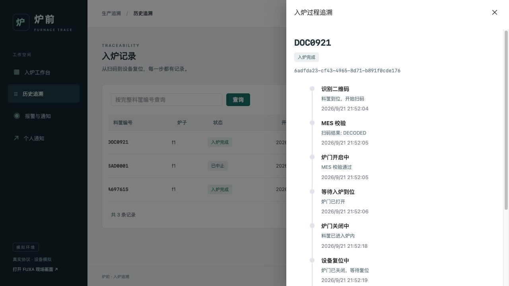

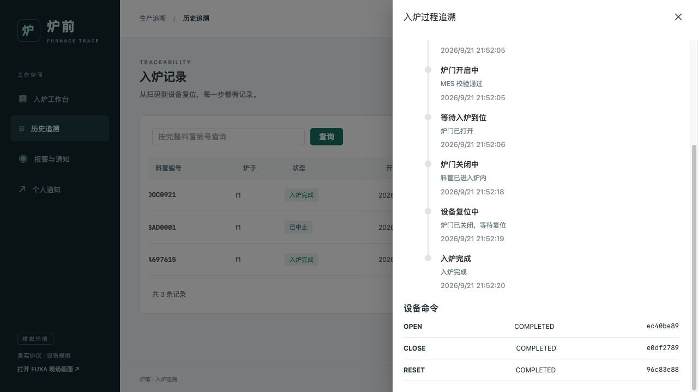

“收到请求”不等于“设备执行完成”。成功记录需要匹配的命令反馈；被人工复位的周期保留为“已中止”，不会伪装成成功。历史保存在服务端，浏览器刷新不会丢失。

## 10. 扫码失败、MES 拒绝与人工复位

| 情况 | 操作流程与结果 |
|---|---|
| 料筐到位后 5 秒内未识别 | 当前周期进入待补录；管理员点“人工补录”，输入二维码原文或料筐号及原因。补录仍走 MES |
| 同时出现多个二维码 | 本次识别按歧义处理；移除多余码，按页面提示补录或处理周期 |
| MES 不存在或质量异常 | 阻止开门，保留拒绝原因；处理现场后按条件人工复位 |
| MES 通信失败 | 有限重试后进入待处理，不绕过校验开门 |
| 门动作或入炉反馈超时 | 进入待人工处理；先处理现场，再复位，不直接记成功 |
| 执行中掉线或设备重启 | 无法证明执行结果时保留未决周期，要求人工处理 |

**自动复位：**扫码/MES 拒绝或流程异常后，系统自动关门、复位，不需要点击按钮。设备反馈后留下审计与已中止记录，恢复持续扫码。设备暂时离线或关门失败时继续自动恢复，不会伪造成功记录。

模拟环境可以执行下面两条演示命令：

```fish
# 质量异常：应看到拒绝，且没有开门命令
python3 scripts/demo.py reject

# 模拟清空入口、人工关门，并复位未完成周期；保留历史
python3 scripts/demo.py reset
```

第二条模拟的是现场故障已消除后的复位动作，不是生产环境的远程强制关门功能。人工复位不会释放成功入炉料筐的占用，因为本期没有出炉功能。

## 11. 答辩时的推荐展示顺序

| 顺序 | 演示动作 | 要说明的重点 |
|---|---|---|
| 1 | 登录，展示工作台与 FUXA | 业务界面与 SCADA 现场界面的分工；设备按独立进程模拟 |
| 2 | FUXA 输入 650.5 并按 Enter | 指出真实命令与反馈路径，工作台只显示回传温度 |
| 3 | 运行一次 `demo.py success` | 摄像头扫码、MES 放行、开门、入炉、关门、复位 |
| 4 | 查询刚才的料筐 | 展示事件时间线和三个完成命令，解释如何追溯 |
| 5 | FUXA 输入 810，再输入 790 | 展示超温报警、恢复及自己的 Telegram 投递 |
| 6 | 展示个人通知偏好 | 同一 Bot 支持多用户，每个人选择自己的炉子和类别 |
| 7（可选） | 执行质量拒绝场景并复位 | 证明 MES 不通过时不会开门，异常记录仍可追溯 |

Telegram 配对最好在演示前完成，避免现场等待配对或网络连接。正常演示不用反复重启服务，也不用删除历史记录。

## 12. 启动、停止与常见问题

### 已构建本地镜像时启动

```fish
cd /path/to/furnace
orb start k8s
fish scripts/up.fish
```

第一次从源码部署需先运行 `fish scripts/build.fish`。本次温度入口已部署并导入 FUXA；日常重启不需要强制替换工程。

只有需要更新仓库生成的 FUXA 工程时，才执行 `python3 scripts/import_fuxa.py --replace-demo-project`。脚本会先备份当前工程到 `.local/backups/`；替换可能覆盖此前人工编辑的画面。

### 停止并保留记录

```fish
# 仅停止本项目服务，保留 PVC 和历史
fish scripts/down.fish

# 如需暂停整个本地 Kubernetes，再执行
orb stop k8s
```

`orb stop k8s` 会暂停整个本地 Kubernetes，不限于本项目。项目 kubectl 操作使用 `scripts/kube.fish`，固定 `orbstack` 上下文与 `iot-lab` 命名空间，不使用当前全局 context。

| 现象 | 先做什么 |
|---|---|
| localhost:31080 无法访问 | 确认 OrbStack Kubernetes 已启动，并运行项目启动脚本 |
| FUXA 401/403 | 在同一浏览器、同一 localhost 主机名登录管理员，再打开 31081 |
| 输入温度未变化 | 确认按了 Enter，比较 FUXA 回传值；在工作台查看温度设备是否在线 |
| 视频有二维码却不入炉 | 检查入口是否到位、有无活动周期；仅显示二维码不会开始入炉 |
| 再次用相同料筐被拒绝 | 成功记录仍占用该编号；演示用新编号，不把复位当成出炉 |
| 报警确认后仍显示活动 | 正常；确认只表示已查看，需消除实际故障 |
| Telegram 没收到 | 检查绑定、总开关、炉子、类别、恢复开关是否保存，再看个人投递结果 |
| 历史/报警列表没更新 | 点击“刷新”；工作台自动同步，列表按查询刷新 |

## 13. 本次截图的运行依据与边界

2026-09-21 在本机 OrbStack `iot-lab` 实际完成：

- 从 FUXA 输入 650.5°C，独立温度模拟器执行并经 SCADA 回传到业务工作台。
- 输入 810°C 触发超温，输入 790°C 恢复；对应报警与恢复任务均获得 Telegram API 成功确认。手机端阅读状态不在本次验证范围。
- 料筐 `DOC0921` 经模拟视频的真实 RTSP 扫码完成入炉，周期编号为 `6adfda23-cf43-4965-8d71-b891f0cde176`，`OPEN/CLOSE/RESET` 反馈均完成。
- 文档图片来自这些实际界面，没有用静态原型代替运行截图；不同截图代表不同操作时刻。

真实 IP 摄像头、真实 PLC 和真实 MES 未接入；双炉视频并发联调未完成；没有进行额外压测或连续重复验收。后台适配器采用 500 ms 轮询，不宣称工业硬实时。源代码和配置说明见 [README](../README.md)、[配置与操作](operations.md)、[账户与配对](accounts-and-pairing.md)。
